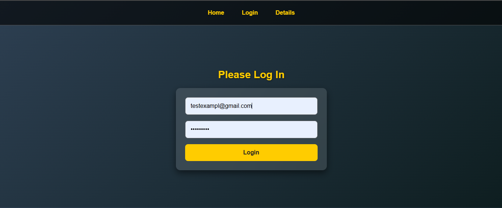
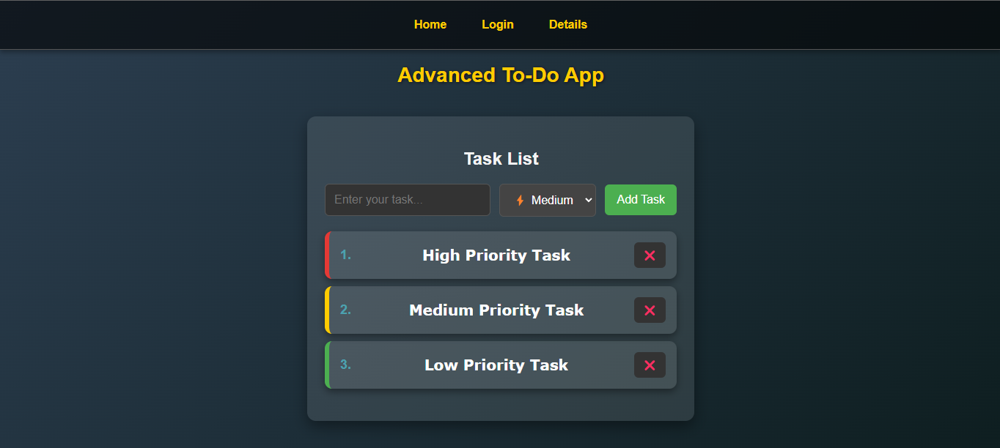

# Advanced React To-Do Application 📝

This is an **Advanced React To-Do App** featuring:

- **Redux State Management**
- **API Integration**
- **Authentication (Fake Login)**
- **Responsive Design**
- **Modern UI with Styled Components**

---

## 📸 Screenshots

### **Login Page**



### **To-Do Dashboard**



---

## 🚀 Features

✅ **User Authentication** (Fake Login)  
✅ **Add, Update, Delete, and Complete To-Dos**  
✅ **Persist State with Redux**  
✅ **Dark Mode Support**  
✅ **Mobile-Friendly UI**

---

## 🔧 Installation & Setup

1️⃣ **Clone the repository**

```sh
git clone https://github.com/yourusername/react-todo-app.git
cd react-todo-app
```
